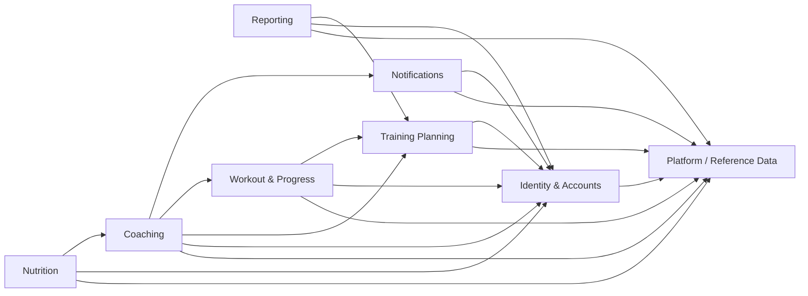
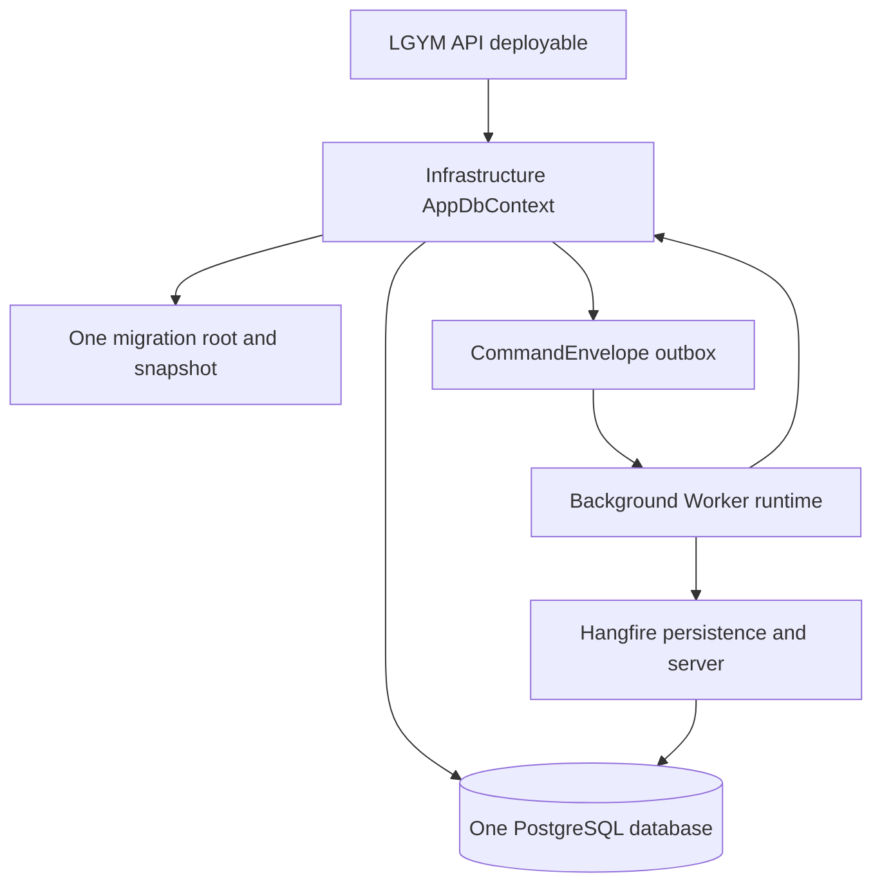

# Issue #395: Final Modular-Monolith Verification

## Status

Implementation commitments complete. Final clean same-SHA evidence is pending Todo 22.

## Final disposition

| Disposition ID | Subject | Owner | Final fact | Verification surface |
| --- | --- | --- | --- | --- |
| `issue395.dependency.graph` | Project topology | Platform / Reference Data | `projects=18; direct-edges=90; forbidden-complement=216` | `issue-380-project-reference-graph.md` |
| `issue395.dependency.persistence` | Physical persistence | Infrastructure | `AppDbContext=1; PostgreSQL-database=1; migration-stream=1; deployables=1` | `SingleProductionDbContextGuardTests` |
| `issue395.dependency.ownership` | Persisted ownership | Eight canonical owners | `entities=48; owners=8` | `PersistedEntityOwnershipCatalog.cs` |
| `issue395.dependency.mapping` | Registered mapping profiles | Platform / Reference Data | `profiles=46` | API composition guards |
| `issue395.dependency.exports` | Direct source public-surface manifest | Five module assemblies | `entries=771` | `ModulePublicSurfaceGuardTests` |

## Adapter disposition

| Adapter ID | Category | Count | Owner | Disposition |
| --- | --- | --- | --- | --- |
| `issue395.adapter.application-api` | Controller-facing API adapters | `25` | Application owners | Owner-oriented scoped contracts remain registered after Infrastructure composition. |
| `issue395.adapter.notifications-api` | Controller-facing API adapters | `3` | Notifications | `IInAppNotificationApiAdapter`, `INotificationEventApiAdapter`, and `IPushInstallationApiAdapter` remain registered by `AddNotificationsApiAdapters`. |
| `issue395.adapter.notifications-integration` | Retained owner-to-owner integration adapters | `3` | Notifications | `PushInstallationSessionDisassociationAdapter`, `CoachingEmailNotificationSchedulerAdapter`, and `PasswordRecoveryEmailSchedulerAdapter` remain because their focused contracts and durable behavior have no approved replacement. |
| `issue395.adapter.migration-clr-removal` | Migration-era adapter CLR identities | `0` | Final cutover | `Task7`, `ApiCompatibility`, and `Compatibility.Task7` adapter CLR identities are absent. External HTTP and JSON contracts remain unchanged. |

## Partial and namespace disposition

| Disposition ID | Subject | Owner | Status | Removal condition |
| --- | --- | --- | --- | --- |
| `issue395.partial.live-contributors` | Approved Reporting, recurring Reporting, Workout Progress, Exercise, Training, and Worker partial contributors | Respective owner | Live contributors only | Remove only with a behavior-preserving owner refactor and updated contribution guard. |
| `issue395.partial.empty-removal` | Empty or unreferenced partial contributors | Final cutover | Removed | Do not restore without a resolved compiled member, owner registration, and caller path. |
| `issue395.namespace.application-compatible` | Established non-Task7 `LgymApi.Application.*` namespaces in extracted owners | Physical owner project | Retained for source or wire compatibility | Separate approved compatibility change with consumer inventory and serialized evidence where applicable. |
| `issue395.constructor.direct-injection` | Direct service constructors | Application, Identity, Notifications | High arity accepted without a numeric cap | Do not replace explicit collaborators with dependency aggregates or service location. |

## Logical owners and allowed dependencies

Consumer-owned authorization ports implemented by Coaching do not create reverse Training Planning or Workout & Progress dependencies. Reporting and Nutrition use only their documented relationship-access surfaces.

## Deployable and persistence topology

The diagram records one deployable context and database. It does not introduce a broker, database per module, schema split, second context, or second migration stream.

## Compatibility commitments

External contracts preserve routes, verbs, policies, DTOs, JSON names, aliases, status codes, localized messages, endpoint-specific legacy fields, idempotency, typed-ID boundary rules, and mapping-profile boundaries. Persisted command writes use canonical `LgymApi.BackgroundWorker.Common.Commands.*` IDs. Worker writes canonical IDs, Application CLR names are read aliases, and Common job interfaces plus recurring identities remain stable.

## Todo 22 same-SHA evidence record

Todo 22 must replace only the values marked `TODO-22-UNFILLED` below after a clean isolated worktree run. These are placeholders, not results.

| Evidence ID | Required command | Recorded result |
| --- | --- | --- |
| `issue395.evidence.pr-sha` | `git rev-parse HEAD` in the clean isolated PR worktree | `TODO-22-UNFILLED` |
| `issue395.evidence.main-sha` | `git rev-parse HEAD` in the clean isolated main worktree | `TODO-22-UNFILLED` |
| `issue395.evidence.matrix` | `pwsh -NoProfile -File scripts/run-verification-matrix.ps1 -Configuration Release` | `TODO-22-UNFILLED` |
| `issue395.evidence.architecture` | `dotnet test LgymApi.ArchitectureTests/LgymApi.ArchitectureTests.csproj --configuration Release --no-build` | `TODO-22-UNFILLED` |
| `issue395.evidence.artifacts` | Validate generated TRX, manifests, hashes, and artifact paths with `scripts/assert-trx.ps1` | `TODO-22-UNFILLED` |

Todo 22 must record the PR SHA, main SHA, command exit codes, parsed counts, and artifact locations only when each result belongs to that clean exact SHA. It must not infer GitHub status, live runtime success, or matrix completion from prior focused runs.

## Known limitations

The shared implementation worktree is dirty, so it cannot produce same-SHA final evidence. Direct local API process smoke is blocked by operator-provided JWT and PostgreSQL runtime configuration. This document makes no claim about a clean-SHA matrix, GitHub status, or a live runtime result.

## Source locators

| Locator ID | Owner | Source locator | Verified fact |
| --- | --- | --- | --- |
| `issue395.locator.application-api-registration` | Application | `LgymApi.Application/ApiAdapters/ServiceCollectionExtensions.cs#ApplicationApiAdapterServiceCollectionExtensions.AddApplicationApiAdapters` | Registers the 25 Application API adapter contracts. |
| `issue395.locator.notifications-api-registration` | Notifications | `LgymApi.Notifications/ServiceCollectionExtensions.cs#ServiceCollectionExtensions.AddNotificationsApiAdapters` | Registers the three Notifications API adapter contracts. |
| `issue395.locator.migration-ledger` | ArchitectureTests | `LgymApi.ArchitectureTests/Issue395MigrationLedgerTests.cs#Issue395MigrationLedgerTests` | Records removed migration-era adapter identities and partial disposition. |
| `issue395.locator.persistence-catalog` | ArchitectureTests | `LgymApi.ArchitectureTests/PersistedEntityOwnershipCatalog.cs#PersistedEntityOwnershipCatalog` | Defines 48 persisted entities across eight owners. |

## Sources

- `docs/adr/007-final-modular-monolith-compatibility-commitments.md`
- `docs/ARCHITECTURE.md`
- `docs/MODULE_CONTRIBUTION_GUIDE.md`
- `LgymApi.ArchitectureTests/Issue395MigrationLedgerTests.cs`
