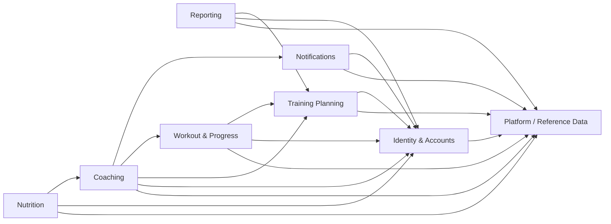
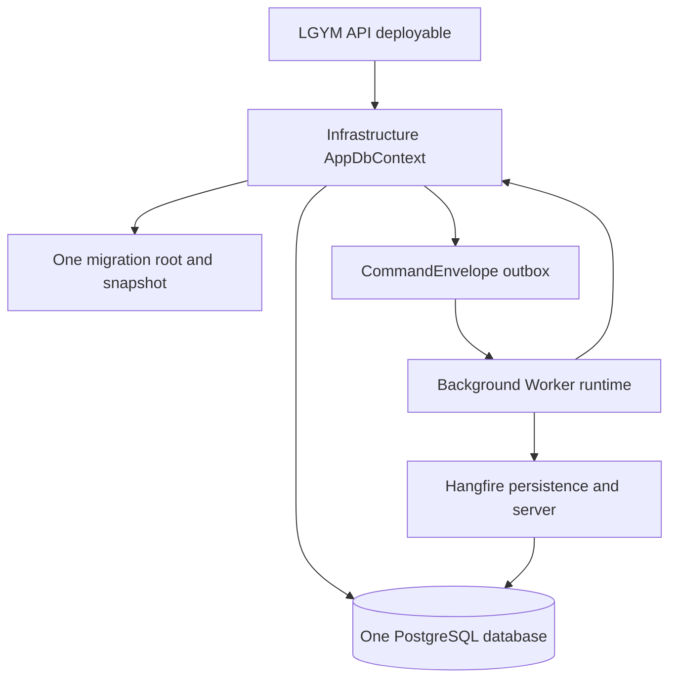

# Issue #395: Final Modular-Monolith Verification

## Status

Implementation commitments complete. Final clean same-SHA evidence is pending Todo 22.

## Final disposition

| Disposition ID | Subject | Owner | Final fact | Verification surface |
| --- | --- | --- | --- | --- |
| `issue395.dependency.graph` | Project topology | Platform / Reference Data | `projects=18; direct-edges=90; forbidden-complement=216` | `issue-380-project-reference-graph.md` |
| `issue395.dependency.persistence` | Physical persistence | Infrastructure | `AppDbContext=1; PostgreSQL-database=1; migration-stream=1; deployables=1` | `SingleProductionDbContextGuardTests` |
| `issue395.dependency.ownership` | Persisted ownership | Eight canonical owners | `entities=48; owners=8` | `PersistedEntityOwnershipCatalog.cs` |
| `issue395.dependency.mapping` | Registered mapping profiles | Platform / Reference Data | `profiles=46` | API composition guards |
| `issue395.dependency.exports` | Direct source public-surface manifest | Five module assemblies | `entries=771` | `ModulePublicSurfaceGuardTests` |

## Adapter disposition

| Adapter ID | Category | Count | Owner | Disposition |
| --- | --- | --- | --- | --- |
| `issue395.adapter.application-api` | Controller-facing API adapters | `25` | Application owners | Owner-oriented scoped contracts remain registered after Infrastructure composition. |
| `issue395.adapter.notifications-api` | Controller-facing API adapters | `3` | Notifications | `IInAppNotificationApiAdapter`, `INotificationEventApiAdapter`, and `IPushInstallationApiAdapter` remain registered by `AddNotificationsApiAdapters`. |
| `issue395.adapter.notifications-integration` | Retained owner-to-owner integration adapters | `3` | Notifications | `PushInstallationSessionDisassociationAdapter`, `CoachingEmailNotificationSchedulerAdapter`, and `PasswordRecoveryEmailSchedulerAdapter` remain because their focused contracts and durable behavior have no approved replacement. |
| `issue395.adapter.migration-clr-removal` | Migration-era adapter CLR identities | `0` | Final cutover | `Task7`, `ApiCompatibility`, and `Compatibility.Task7` adapter CLR identities are absent. External HTTP and JSON contracts remain unchanged. |

## Partial and namespace disposition

| Disposition ID | Subject | Owner | Status | Removal condition |
| --- | --- | --- | --- | --- |
| `issue395.partial.live-contributors` | Approved Reporting, recurring Reporting, Workout Progress, Exercise, Training, and Worker partial contributors | Respective owner | Live contributors only | Remove only with a behavior-preserving owner refactor and updated contribution guard. |
| `issue395.partial.empty-removal` | Empty or unreferenced partial contributors | Final cutover | Removed | Do not restore without a resolved compiled member, owner registration, and caller path. |
| `issue395.namespace.application-compatible` | Established non-Task7 `LgymApi.Application.*` namespaces in extracted owners | Physical owner project | Retained for source or wire compatibility | Separate approved compatibility change with consumer inventory and serialized evidence where applicable. |
| `issue395.constructor.direct-injection` | Direct service constructors | Application, Identity, Notifications | High arity accepted without a numeric cap | Do not replace explicit collaborators with dependency aggregates or service location. |

## Logical owners and allowed dependencies

Consumer-owned authorization ports implemented by Coaching do not create reverse Training Planning or Workout & Progress dependencies. Reporting and Nutrition use only their documented relationship-access surfaces.

## Deployable and persistence topology

The diagram records one deployable context and database. It does not introduce a broker, database per module, schema split, second context, or second migration stream.

## Compatibility commitments

External contracts preserve routes, verbs, policies, DTOs, JSON names, aliases, status codes, localized messages, endpoint-specific legacy fields, idempotency, typed-ID boundary rules, and mapping-profile boundaries. Persisted command writes use canonical `LgymApi.BackgroundWorker.Common.Commands.*` IDs. Worker writes canonical IDs, Application CLR names are read aliases, and Common job interfaces plus recurring identities remain stable.

## Todo 22 same-SHA evidence record

Todo 22 completed from a clean isolated verifier. The matrix evidence below is tied only to the tested SHA, not to this later documentation record.

| Evidence ID | Required command | Recorded result |
| --- | --- | --- |
| `issue395.evidence.pr-sha` | `git rev-parse HEAD` in the clean isolated PR worktree | `tested-sha=9370cc9b36922afc676240f549735d1308d832b4; detached; status=clean` |
| `issue395.evidence.main-sha` | `git rev-parse HEAD` in the clean isolated main worktree | `main-sha=5cdef880395d6c991b4ea9cb9d7a3b914317e0ae; detached; status=clean; not matrix-tested` |
| `issue395.evidence.matrix` | `pwsh -NoProfile -File scripts/run-verification-matrix.ps1 -ResultsDirectory TestResults/Final/issue-395-todo-22-9370cc9-20260731 -Configuration Release` | `matrix=passed; Release; Unit/Architecture/InMemoryIntegration/PostgreSqlIntegration/DataSeeder=1966/665/599/660/43` |
| `issue395.evidence.architecture` | `dotnet test LgymApi.ArchitectureTests/LgymApi.ArchitectureTests.csproj --configuration Release --no-build` | `Architecture=665/665 in matrix; source-locator/topology supplementary=26/26; CRLF verifier regression=4/4` |
| `issue395.evidence.artifacts` | Validate generated TRX, manifests, hashes, and artifact paths with `scripts/assert-trx.ps1` | `artifact-validation=passed; Worker-related Unit discovery=59; redaction, cleanup, EF, and supplementary gates passed` |

The tested verifier was `C:\code\LGYM-APP-APIv3-wt-issue-395-final-modular-monolith-verification-9370cc9`. Its ignored evidence root is `TestResults/Final/issue-395-todo-22-9370cc9-20260731/20260731T170324Z-64ca984c4b464d5c98aaf38263f432ff`; `artifact-manifest.json` SHA-256 is `b08563181947a0c34c346e65b4ebdae0ae9cbbd08349d20ade85ac43f8a4ad13`.

| Complete suite | Passed / total | Discovery SHA-256 | TRX SHA-256 | Summary SHA-256 |
| --- | --- | --- | --- | --- |
| Unit | `1966/1966` | `c1224a18fbdfbf7918003fae830fe70674c9cebe58c5f050875c345eaa6b079b` | `137633ffa4eee84625fb7f3cbd044f6d913bc058e5a69f2c6c01306e03427157` | `14ae2eea356a0935e6449ad923bd735ed0efbbca36415b63b0e7fd730e4f041f` |
| Architecture | `665/665` | `a587e2b4774ce49063df6bc9e4c904bd29c81b11eb2cf9d26dfb0e40ab3b8e72` | `09bc4edf5ee497ebde06e3dd87df86198478e242ffd11fa91c7c59330720fb34` | `359815b153de926cca8bab419e0e0a6e15e32cad50bbe7c95d308b4cd0c81dc4` |
| InMemoryIntegration | `599/599` | `090d59772272e29a095676a35f31a23bb26923f05d1b26c09e368644a252fb0e` | `fa6267a39282764d51284eea7d2e687ad04817faf52d47852c74d5a7532abe66` | `19bed3907ea3bdb3579c0b2d4423dde260500497a4bc0eefe76a8dcb12c4cf3d` |
| PostgreSqlIntegration | `660/660` | `02703f95662ae12bbbf941bf009495d6512c195ac6dcfb576a0e8e815b5286d7` | `c95531d65bde9a45d25806c21d9bc05cb7efd42cc69b1665c4856aba89ebd170` | `f9cb9b0184ffea38da61bdb0acccd6e865856146fcf2aa013a5ec2d430cab223` |
| DataSeeder | `43/43` | `387abb75fdc37686b1799ccd18134a1eec7c1f17735ae3a67e618d499809d71b` | `e6950c42369985c154a3d072067a450060c699050f07988d826911bba236b19b` | `751e763b46c40045956d18e2a94e8e8979b975de62f606c35c4c1efa3ccd9ef3` |

Supplementary results: `RuntimeCompositionValidationTests` `4/4` (`8b1abd669d43a18c51da1cd6bf970f546aaad0054468e6d1ce61ee5ddb2f704d`), `IndependentExportedSurfaceTests` `3/3` (`3a544279d31dbc9636fa6df074994143a8282a03788f5dfcd24d4b7675523f9a`), `EndpointContractMatrixTests` `10/10` (`5235e442b59604091697bec23f3cc10d28e28fb5d437ab82887ef46e4ea60e02`), source-locator/topology `26/26` (`26fac48ea1edd024d965f9b34524dfabe898a8e24b9b5a977d2ab892be3cd372`), and `PostgreSqlHangfireDurabilityTests` `1/1` (`8476d2ffef2de72991a6345665d189b54c80f5c90f927cb75645e1ad787c6ba9`). The exported redacted Hangfire receipt is `supplementary/postgresql-hangfire-durability.md`.

The repeated Release build binlog is `supplementary/release-build.binlog` (SHA-256 `5bddbf7b4896ecd41ce7c211ba0b84c92f6e556fe249b83f218144031ab19ffe`). Artifact validation recorded redaction success, exact discovery/TRX identity, manifest hashes, and the nonzero 59-test Worker-related Unit subset in `supplementary/artifact-validation.json`. The failure-path PostgreSQL cleanup probe passed with `exit=1, containers=0, volumes=0`; it removes its working directory by design. `dotnet ef migrations list` and `dotnet ef migrations has-pending-model-changes` both exited 0, with redacted logs at `supplementary/ef-migrations-list.log` and `supplementary/ef-pending-model-changes.log`.

## Known limitations

Direct local API process smoke remains blocked by operator-provided JWT and PostgreSQL runtime configuration. This record makes no GitHub-status or live direct-runtime claim; it records only the clean-SHA automated matrix and supplementary evidence above.

## Source locators

| Locator ID | Owner | Source locator | Verified fact |
| --- | --- | --- | --- |
| `issue395.locator.application-api-registration` | Application | `LgymApi.Application/ApiAdapters/ServiceCollectionExtensions.cs#ApplicationApiAdapterServiceCollectionExtensions.AddApplicationApiAdapters` | Registers the 25 Application API adapter contracts. |
| `issue395.locator.notifications-api-registration` | Notifications | `LgymApi.Notifications/ServiceCollectionExtensions.cs#ServiceCollectionExtensions.AddNotificationsApiAdapters` | Registers the three Notifications API adapter contracts. |
| `issue395.locator.migration-ledger` | ArchitectureTests | `LgymApi.ArchitectureTests/Issue395MigrationLedgerTests.cs#Issue395MigrationLedgerTests` | Records removed migration-era adapter identities and partial disposition. |
| `issue395.locator.persistence-catalog` | ArchitectureTests | `LgymApi.ArchitectureTests/PersistedEntityOwnershipCatalog.cs#PersistedEntityOwnershipCatalog` | Defines 48 persisted entities across eight owners. |

## Sources

- `docs/adr/007-final-modular-monolith-compatibility-commitments.md`
- `docs/ARCHITECTURE.md`
- `docs/MODULE_CONTRIBUTION_GUIDE.md`
- `LgymApi.ArchitectureTests/Issue395MigrationLedgerTests.cs`
