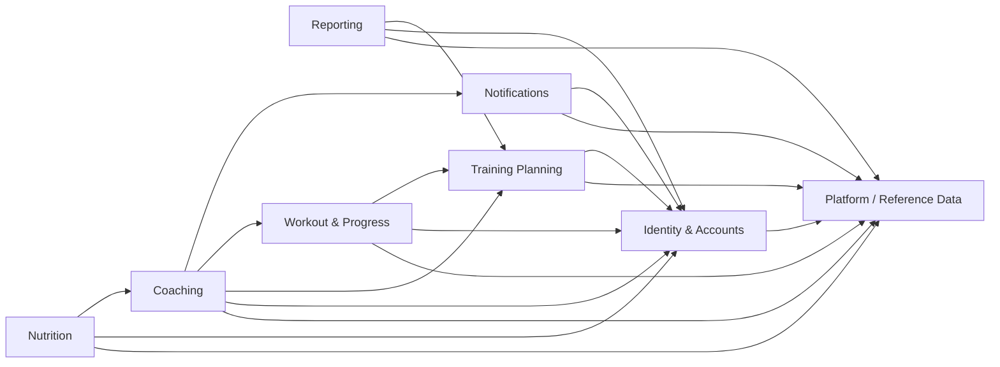
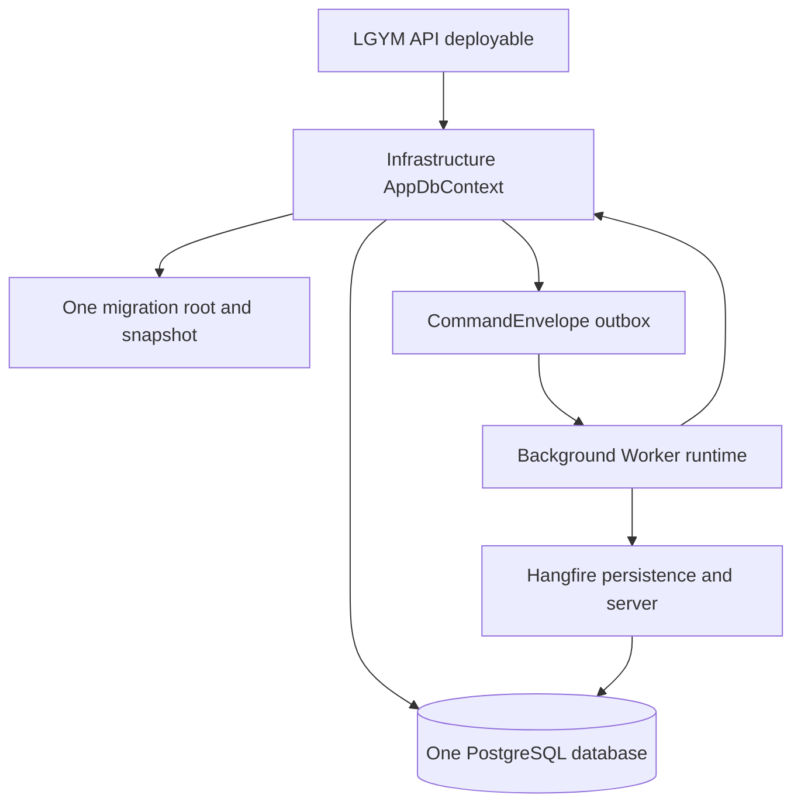

# Issue #395: Final Modular-Monolith Verification

## Status

Implementation commitments complete. Final clean same-SHA evidence is pending Todo 22.

## Final disposition

| Disposition ID | Subject | Owner | Final fact | Verification surface |
| --- | --- | --- | --- | --- |
| `issue395.dependency.graph` | Project topology | Platform / Reference Data | `projects=18; direct-edges=90; forbidden-complement=216` | `issue-380-project-reference-graph.md` |
| `issue395.dependency.persistence` | Physical persistence | Infrastructure | `AppDbContext=1; PostgreSQL-database=1; migration-stream=1; deployables=1` | `SingleProductionDbContextGuardTests` |
| `issue395.dependency.ownership` | Persisted ownership | Eight canonical owners | `entities=48; owners=8` | `PersistedEntityOwnershipCatalog.cs` |
| `issue395.dependency.mapping` | Registered mapping profiles | Platform / Reference Data | `profiles=46` | API composition guards |
| `issue395.dependency.exports` | Direct source public-surface manifest | Five module assemblies | `entries=771` | `ModulePublicSurfaceGuardTests` |

## Adapter disposition

| Adapter ID | Category | Count | Owner | Disposition |
| --- | --- | --- | --- | --- |
| `issue395.adapter.application-api` | Controller-facing API adapters | `25` | Application owners | Owner-oriented scoped contracts remain registered after Infrastructure composition. |
| `issue395.adapter.notifications-api` | Controller-facing API adapters | `3` | Notifications | `IInAppNotificationApiAdapter`, `INotificationEventApiAdapter`, and `IPushInstallationApiAdapter` remain registered by `AddNotificationsApiAdapters`. |
| `issue395.adapter.notifications-integration` | Retained owner-to-owner integration adapters | `3` | Notifications | `PushInstallationSessionDisassociationAdapter`, `CoachingEmailNotificationSchedulerAdapter`, and `PasswordRecoveryEmailSchedulerAdapter` remain because their focused contracts and durable behavior have no approved replacement. |
| `issue395.adapter.migration-clr-removal` | Migration-era adapter CLR identities | `0` | Final cutover | `Task7`, `ApiCompatibility`, and `Compatibility.Task7` adapter CLR identities are absent. External HTTP and JSON contracts remain unchanged. |

## Partial and namespace disposition

| Disposition ID | Subject | Owner | Status | Removal condition |
| --- | --- | --- | --- | --- |
| `issue395.partial.live-contributors` | Approved Reporting, recurring Reporting, Workout Progress, Exercise, Training, and Worker partial contributors | Respective owner | Live contributors only | Remove only with a behavior-preserving owner refactor and updated contribution guard. |
| `issue395.partial.empty-removal` | Empty or unreferenced partial contributors | Final cutover | Removed | Do not restore without a resolved compiled member, owner registration, and caller path. |
| `issue395.namespace.application-compatible` | Established non-Task7 `LgymApi.Application.*` namespaces in extracted owners | Physical owner project | Retained for source or wire compatibility | Separate approved compatibility change with consumer inventory and serialized evidence where applicable. |
| `issue395.constructor.direct-injection` | Direct service constructors | Application, Identity, Notifications | High arity accepted without a numeric cap | Do not replace explicit collaborators with dependency aggregates or service location. |

## Logical owners and allowed dependencies

Consumer-owned authorization ports implemented by Coaching do not create reverse Training Planning or Workout & Progress dependencies. Reporting and Nutrition use only their documented relationship-access surfaces.

## Deployable and persistence topology

The diagram records one deployable context and database. It does not introduce a broker, database per module, schema split, second context, or second migration stream.

## Compatibility commitments

External contracts preserve routes, verbs, policies, DTOs, JSON names, aliases, status codes, localized messages, endpoint-specific legacy fields, idempotency, typed-ID boundary rules, and mapping-profile boundaries. Persisted command writes use canonical `LgymApi.BackgroundWorker.Common.Commands.*` IDs. Worker writes canonical IDs, Application CLR names are read aliases, and Common job interfaces plus recurring identities remain stable.

## Todo 22 same-SHA evidence record

Todo 22 completed from a clean isolated verifier. The matrix evidence below is tied only to the tested SHA, not to this later documentation record.

| Evidence ID | Required command | Recorded result |
| --- | --- | --- |
| `issue395.evidence.pr-sha` | `git rev-parse HEAD` in the clean isolated PR worktree | `tested-sha=fd06249771676f65c20e8f675535974db6b7d071; detached; status=clean` |
| `issue395.evidence.main-sha` | `git rev-parse HEAD` in the clean isolated main worktree | `main-sha=5cdef880395d6c991b4ea9cb9d7a3b914317e0ae; detached; status=clean; not matrix-tested` |
| `issue395.evidence.matrix` | `pwsh -NoProfile -File scripts/run-verification-matrix.ps1 -ResultsDirectory TestResults/Final/issue-395-todo-22-fd06249-20260731 -Configuration Release` | `matrix=passed; Release; Unit/Architecture/InMemoryIntegration/PostgreSqlIntegration/DataSeeder=1966/665/599/660/43` |
| `issue395.evidence.architecture` | `dotnet test LgymApi.ArchitectureTests/LgymApi.ArchitectureTests.csproj --configuration Release --no-build` | `Architecture=665/665 in matrix; focused exported-surface, documentation, and topology checks=25/25` |
| `issue395.evidence.artifacts` | Validate generated TRX, manifests, hashes, and artifact paths with `scripts/assert-trx.ps1` | `artifact-validation=passed by matrix suite assertions; focused PostgreSQL cleanup and Hangfire durability checks passed` |

The tested verifier was `C:\code\LGYM-APP-APIv3-wt-issue-395-final-modular-monolith-verification-fd06249`. Its ignored evidence root is `TestResults/Final/issue-395-todo-22-fd06249-20260731/20260731T174328Z-c92ff07089bf449a98e443d3882ec251`; `artifact-manifest.json` SHA-256 is `50ac41a88dbbc073ea71caf97a3ba185c81dfd0ceaedf3e8bf01788527feacd5`.

| Complete suite | Passed / total | Discovery SHA-256 | TRX SHA-256 | Summary SHA-256 |
| --- | --- | --- | --- | --- |
| Unit | `1966/1966` | `598cea06c30822c46b14e837e28548d7e93b2c52a0e61e8846205e1c04f91fd5` | `69dced72a4b37d398199c989d283d25aa29ef104008acf04712a22688a213e87` | `b07f96415568c9695812248e8a5505381d9365a02cbdeb623b2cd30b0aad0623` |
| Architecture | `665/665` | `fda65c85de294fbb1a2f9df23374e54db7d860e7a309e50f02700ceaeefac4b7` | `75b83972f3c9e43fab8c3655ca0591b5e7ba8473f0b4e0d707b7297543192ffd` | `0dec506212235cec956b9b80f3d339b8dc936f61ba2dd3f80bb246c43e76da46` |
| InMemoryIntegration | `599/599` | `7373a86fd5b88028b6a11dc3d140fd0f5cdec8560a01171a80c6f3e5a2f43193` | `1c91c2c7b50f8f40125ba9f8f54d76a42b22931992b503cc1717a2803e315a66` | `3fd70e05cdcd8e4d04e64693810cb7c5fa5b4ac07179554bc350f147fcf3c8b6` |
| PostgreSqlIntegration | `660/660` | `2832539493a0f6cd966e96df061955a687190280c0f781541c6ca95e2c9c6667` | `e31e0bbcef556f781766c939fcbd7d47a7391b507f1d226f1613346decbcad5d` | `aa7f4f250518f29b60c35b60dacd146c2c9f310c022da06caf7f2e8450363b72` |
| DataSeeder | `43/43` | `41251032f012b8ecc78664460bb69be9b9823e077ae8eb774a8d18a5590ebe18` | `286f1f94d729cf66b1aa163d7ec79f478b4e2e2531292541f1c8d4ea6da0cf56` | `5c4f710e90edbb5e368a4c215d1704049fb0f1a6f004c35261de345c3081ecf4` |

Supplementary results on the same clean verifier: `RuntimeCompositionValidationTests` `4/4`, focused exported-surface/documentation/topology checks `25/25`, `EndpointContractMatrixTests` `10/10`, and `PostgreSqlHangfireDurabilityTests` `1/1`. The PostgreSQL runner failure-path cleanup probe passed with `exit=1, containers=0, volumes=0`; it removes its working directory by design.

## Known limitations

Direct local API process smoke remains blocked by operator-provided JWT and PostgreSQL runtime configuration. This record makes no GitHub-status or live direct-runtime claim; it records only the clean-SHA automated matrix and supplementary evidence above.

## Source locators

| Locator ID | Owner | Source locator | Verified fact |
| --- | --- | --- | --- |
| `issue395.locator.application-api-registration` | Application | `LgymApi.Application/ApiAdapters/ServiceCollectionExtensions.cs#ApplicationApiAdapterServiceCollectionExtensions.AddApplicationApiAdapters` | Registers the 25 Application API adapter contracts. |
| `issue395.locator.notifications-api-registration` | Notifications | `LgymApi.Notifications/ServiceCollectionExtensions.cs#ServiceCollectionExtensions.AddNotificationsApiAdapters` | Registers the three Notifications API adapter contracts. |
| `issue395.locator.migration-ledger` | ArchitectureTests | `LgymApi.ArchitectureTests/Issue395MigrationLedgerTests.cs#Issue395MigrationLedgerTests` | Records removed migration-era adapter identities and partial disposition. |
| `issue395.locator.persistence-catalog` | ArchitectureTests | `LgymApi.ArchitectureTests/PersistedEntityOwnershipCatalog.cs#PersistedEntityOwnershipCatalog` | Defines 48 persisted entities across eight owners. |

## Sources

- `docs/adr/007-final-modular-monolith-compatibility-commitments.md`
- `docs/ARCHITECTURE.md`
- `docs/MODULE_CONTRIBUTION_GUIDE.md`
- `LgymApi.ArchitectureTests/Issue395MigrationLedgerTests.cs`
