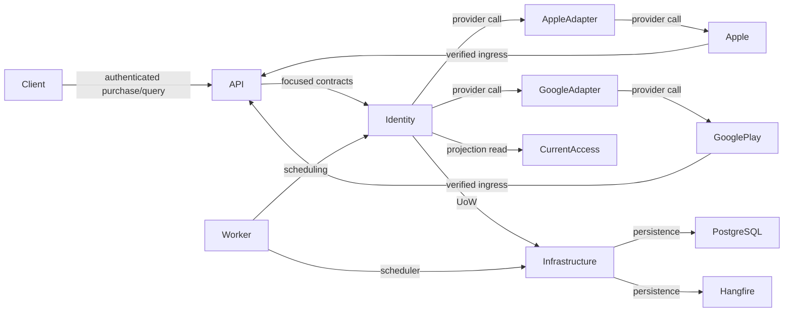

# Direct Store Subscriptions

## Status and Current vs Future Legend

This is the canonical future-state logical contract for issue #443. `current`, `current/future`, and `current/durable` rows describe executable authorities that already exist. `future` rows describe proposed boundaries only. All named future entities, contracts, providers, endpoints, jobs, and configuration are proposed and not implemented by #443. No current implementation or paid benefit is activated.

## Source Precedence

1. Executable architecture authorities and guards are authoritative for current state.
2. `docs/ARCHITECTURE.md` and the modular-monolith boundary documents define the current layered and topology rules.
3. This document fixes the future direct-store subscription boundary without changing current topology or ownership.

## Scope and Non-Goals

Identity owns future direct Apple and Google subscription business rules, logical writes, provider adapters, and normalized outcomes. API remains transport only, Worker remains scheduling only, Infrastructure retains shared technical roots, and Common remains closed. This contract doesn't add runtime code, entities, persistence objects, provider calls, endpoints, options binding, config values, packages, migrations, or paid capability enforcement.

## Stable Boundary Table

| Boundary ID | State | Owner / authority | Owner responsibility | Allowed placement/dependencies | Forbidden condition | Source locator |
| --- | --- | --- | --- | --- | --- | --- |
| `subscriptions.boundary.current-state` | current | executable eight-owner/48-entity authority | current persisted ownership roster | current executable ownership catalog | subscription implementation is not current state | `LgymApi.ArchitectureTests/PersistedEntityOwnershipCatalog.cs#PersistedEntityOwnershipCatalog` |
| `subscriptions.boundary.identity-owner` | future | Identity & Accounts | all subscription business, write, and provider ownership | Identity with current Domain, Platform, and Resources dependencies | no subscription ownership in API, Worker, Infrastructure, or Common | `LgymApi.Identity/IdentityModule.cs#IdentityModule` |
| `subscriptions.boundary.api-transport` | future | API | HTTP transport only | existing API-to-Identity edge and authenticated account context | no business policy or provider handling in controllers | `LgymApi.Api/Features/Account/Controllers/AccountController.cs#AccountController` |
| `subscriptions.boundary.worker-scheduling` | future | Worker | recurring scheduling for Identity public use cases | existing Worker-to-Identity edge and Infrastructure scheduler composition | no subscription job, payload, or provider type in Common | `LgymApi.BackgroundWorker/BackgroundWorkerRecurringJobs.cs#BackgroundWorkerRecurringJobs` |
| `subscriptions.boundary.infrastructure-runtime` | current/future | Infrastructure | unchanged shared technical roots only | one shared AppDbContext, UoW, migrations, and Hangfire persistence | no subscription business policy or provider adapter ownership | `LgymApi.Infrastructure/Data/AppDbContext.cs#AppDbContext` |
| `subscriptions.boundary.common-closure` | current/durable | BackgroundWorker.Common | exact closed persisted-job and email-wire surface | existing Common contract surface only | no subscription additions to Common | `LgymApi.ArchitectureTests/BackgroundWorkerCommonSurfaceGuardTests.cs#BackgroundWorkerCommonSurfaceGuardTests` |
| `subscriptions.boundary.project-graph` | current/durable | executable 18-project/90-edge authority | preserve current project topology | existing project-reference graph only | no added, removed, duplicated, or cyclic project edge | `LgymApi.ArchitectureTests/ProjectReferenceGraphManifest.cs#ProjectReferenceGraphManifest` |

## Stable Contract Table

| Contract ID | State | Owner | Provider-neutral contract | Persistence/message rule | Explicit exclusion |
| --- | --- | --- | --- | --- | --- |
| `subscriptions.contract.grant` | future | Identity & Accounts | durable subscription grant contract | owner-local persistence with one service-owned UoW boundary | provider SDK/response/credential/raw payload, foreign entity/repository, direct repository save, Common/Hangfire type |
| `subscriptions.contract.inbox` | future | Identity & Accounts | durable provider-event inbox contract | owner-local inbox persistence with one service-owned UoW boundary | provider SDK/response/credential/raw payload, foreign entity/repository, direct repository save, Common/Hangfire type |
| `subscriptions.contract.account-binding` | future | Identity & Accounts | account/store binding contract | owner-local binding persistence with one service-owned UoW boundary | provider SDK/response/credential/raw payload, foreign entity/repository, direct repository save, Common/Hangfire type |
| `subscriptions.contract.current-access` | future | Identity & Accounts | effective current paid-access projection contract | owner-local projection persistence with one service-owned UoW boundary | provider SDK/response/credential/raw payload, foreign entity/repository, direct repository save, Common/Hangfire type |
| `subscriptions.contract.provider-verification` | future | Identity & Accounts | internal provider-verification port returning normalized results | internal Identity adapter boundary; no provider payload persistence in the contract | provider SDK/response/credential/raw payload, foreign entity/repository, direct repository save, Common/Hangfire type |
| `subscriptions.contract.provider-notification` | future | Identity & Accounts | internal provider-notification port returning normalized results | internal Identity adapter boundary; durable inbox state remains owner-local | provider SDK/response/credential/raw payload, foreign entity/repository, direct repository save, Common/Hangfire type |
| `subscriptions.contract.processing` | future | Identity & Accounts | public Worker-facing inbox processing use case | recurring batch accepts only CancellationToken; record selection and cursors stay in owner persistence | provider SDK/response/credential/raw payload, foreign entity/repository, direct repository save, Common/Hangfire type |
| `subscriptions.contract.reconciliation` | future | Identity & Accounts | public Worker-facing provider reconciliation use case | recurring batch accepts only CancellationToken; record selection and cursors stay in owner persistence | provider SDK/response/credential/raw payload, foreign entity/repository, direct repository save, Common/Hangfire type |
| `subscriptions.contract.api-ingress` | future | API | thin provider-ingress transport adapter | inject focused Identity contracts and use authenticated account context where applicable | provider SDK/response/credential/raw payload, foreign entity/repository, direct repository save, Common/Hangfire type |
| `subscriptions.contract.api-query` | future | API | thin current-access query transport adapter | inject focused Identity query contract and use authenticated account context | provider SDK/response/credential/raw payload, foreign entity/repository, direct repository save, Common/Hangfire type |
| `subscriptions.contract.mapping` | future | API | registered custom IMapper profiles | cross-layer model conversion remains in API mapping profiles | provider SDK/response/credential/raw payload, foreign entity/repository, direct repository save, Common/Hangfire type |
| `subscriptions.contract.localization` | future | Resources | EN/PL resource-backed user-facing messages | localized messages remain in the Resources boundary | provider SDK/response/credential/raw payload, foreign entity/repository, direct repository save, Common/Hangfire type |
| `subscriptions.contract.persistence-topology` | future | Identity and Infrastructure | provider-neutral logical write and physical persistence seam | logical writes belong to Identity; context, UoW, and migrations remain in Infrastructure | provider SDK/response/credential/raw payload, foreign entity/repository, direct repository save, Common/Hangfire type |

## Stable Provider Table

| Provider ID | State | Owner | Fixed authority/trust input | Verification/retry rule | Public-contract exclusion | Redaction class |
| --- | --- | --- | --- | --- | --- | --- |
| `subscriptions.provider.apple-production` | future | Identity & Accounts | Apple production authority https://api.storekit.apple.com; verified JWS/certificate/app/environment/account binding before normalization | fixed authority; bounded, cancellation-aware, idempotent retry policy is deferred | no provider SDK/response/credential/raw payload | metadata-only |
| `subscriptions.provider.apple-sandbox` | future | Identity & Accounts | Apple sandbox authority https://api.storekit-sandbox.apple.com; verified JWS/certificate/app/environment/account binding before normalization | fixed authority; bounded, cancellation-aware, idempotent retry policy is deferred | no provider SDK/response/credential/raw payload | metadata-only |
| `subscriptions.provider.apple-signed-data` | future | Identity & Accounts | verified JWS/certificate/app/environment/account binding before normalization | bounded, cancellation-aware, idempotent retry policy; never surface full bodies or exceptions | no signed payload, provider SDK/response, credential, or raw provider body | signed-payload |
| `subscriptions.provider.google-play` | future | Identity & Accounts | Google Android Publisher authority https://androidpublisher.googleapis.com; authoritative purchases.subscriptionsv2.get current-state re-query | bounded, cancellation-aware, idempotent retry policy; honor transient guidance and Retry-After | no provider SDK/response, purchase token, credential, or raw provider body | purchase-token;provider-body;credential |
| `subscriptions.provider.google-rtdn` | future | Identity & Accounts | verified Pub/Sub OIDC identity/envelope bounds then provider re-query via purchases.subscriptionsv2.get; OIDC checks include signature, issuer, audience, expiry, expected service-account email, and email_verified | bounded, cancellation-aware, idempotent retry policy; never trust notification order or body alone | no Pub/Sub/provider SDK/response, purchase token, credential, or raw provider body | provider-body;credential |
| `subscriptions.provider.sanitized-errors` | future | Identity & Accounts | provider-neutral authentication, validation, throttled, transient, and unavailable outcomes | bounded and cancellation-aware; sanitize provider bodies and exceptions | no provider body, exception, credential, SDK response, or raw payload | metadata-only |

## Stable Configuration Table

| Configuration ID | State | Key/root | Default | Requires | Enables | Forbidden effect |
| --- | --- | --- | --- | --- | --- | --- |
| `subscriptions.configuration.root` | future | `Subscriptions:*` | no value/default | none | Identity-owned subscription configuration namespace | no binding or runtime value change in #443 |
| `subscriptions.configuration.apple` | future | `Subscriptions:Apple:*` | no value/default | Subscriptions:Enabled | Apple provider child leaves | no runtime host override or public provider contract |
| `subscriptions.configuration.google-play` | future | `Subscriptions:GooglePlay:*` | no value/default | Subscriptions:Enabled | Google Play provider child leaves | no runtime host override or public provider contract |
| `subscriptions.configuration.processing` | future | `Subscriptions:Processing:*` | no value/default | Subscriptions:Enabled | processing child leaves | no runtime registration or value file change |
| `subscriptions.configuration.reconciliation` | future | `Subscriptions:Reconciliation:*` | no value/default | Subscriptions:Enabled | reconciliation child leaves | no runtime registration or value file change |
| `subscriptions.configuration.enabled` | future | `Subscriptions:Enabled` | false; missing or unparseable is false | none | provider ingress/calls and lifecycle processing | never hides durable current access, grants access, erases state, or changes free baseline |
| `subscriptions.configuration.apple-enabled` | future | `Subscriptions:Apple:Enabled` | false; missing or unparseable is false | Subscriptions:Enabled | only the Apple adapter | disabling does not cancel, refund, or delete its grant |
| `subscriptions.configuration.google-play-enabled` | future | `Subscriptions:GooglePlay:Enabled` | false; missing or unparseable is false | Subscriptions:Enabled | only the Google Play adapter | disabling does not cancel, refund, or delete its grant |
| `subscriptions.configuration.purchases-enabled` | future | `Subscriptions:PurchasesEnabled` | false; missing or unparseable is false | global enabled plus relevant provider enabled | new client purchase verification | does not disable restore or lifecycle repair |
| `subscriptions.configuration.projection-apply-enabled` | future | `Subscriptions:ProjectionApplyEnabled` | false; missing or unparseable is false | global enabled plus relevant provider enabled | paid-projection mutation while allowing observe-only durable metadata | does not grant paid access or erase durable inbox/reconciliation state |
| `subscriptions.configuration.capability-enforcement-enabled` | future | `Subscriptions:CapabilityEnforcementEnabled` | false; missing or unparseable is false | global enabled plus projection apply plus separately approved and shipped paid-benefit release | paid-benefit capability enforcement only after approved release | no effect before release and no module lock in #443 |

## Stable Policy Table

| Policy ID | State | Rule | Evidence/guard | Explicit non-goal |
| --- | --- | --- | --- | --- |
| `subscriptions.policy.tiers` | future | exactly tier_1 rank 1, tier_2 rank 2, and tier_3 rank 3 | stable policy row parser and focused architecture guard | no catalog, pricing, or billing-period implementation |
| `subscriptions.policy.free-baseline` | future | unchanged free baseline and not a fourth profile | focused policy assertion | no paid capability enforcement in #443 |
| `subscriptions.policy.cross-store` | future | independent grants; highest currently valid tier wins; no automatic cross-store cancel or refund | focused cross-store policy assertion | no automatic Apple/Google coupling |
| `subscriptions.policy.server-authority` | future | durable inbox is processing authority; verified provider re-query plus durable grant/projection is access authority | focused authority and source-of-truth assertion | no unverified notification or client success flag as authority |
| `subscriptions.policy.jwt` | future | no long-lived paid claim, role, or permission authority in JWT | focused JWT exclusion assertion | no migration to JWT-paid entitlements |
| `subscriptions.policy.tests` | future | parser, provider-surface, topology/Common/persistence parity, fixtures, and targeted/full Release evidence | Todo 2 focused guard and later Release evidence | no provider call or cryptography proof in Todo 1 |
| `subscriptions.policy.rollout` | future | docs and guards first; all controls false; no sale or module lock | focused rollout/control-state assertion | no production activation or paid benefit release |
| `subscriptions.policy.rollback` | future | remove contract only before dependent child implementation; otherwise supersede without deleting commerce state | focused rollback rule assertion | no durable commerce-state deletion as rollback |

## Future Artifact and Type Placement

When #446 implements them, `AccountSubscriptionGrant`, `SubscriptionInboxEvent`, and `AccountPaidAccessProjection` follow the existing Domain entity convention under `LgymApi.Domain/Entities`. Provider-neutral public Identity contracts belong under `LgymApi.Identity/Contracts/Subscriptions/**`. Internal Identity subscription use cases, persistence and provider work stay under `LgymApi.Identity/Subscriptions/**`, behind `IIdentityPersistenceContext`.

Future Account and Webhooks transport roots are `LgymApi.Api/Features/Account/Subscriptions/**` and `LgymApi.Api/Features/Webhooks/Subscriptions/**`, with registered API mapping profiles. These adapters inject focused Identity contracts directly, with no Application compatibility facade. #454 alone may add direct Worker recurring expressions. No Common subscription type exists or is proposed.

## Dependency and Source Flow

This is a future-state logical flow over the existing project graph. Its logical arrows don't add project references.

## Persistence, Unit of Work, and Inbox Authority

Logical ownership stays with Identity while physical `AppDbContext`, Unit of Work, migration, and Hangfire roots stay in Infrastructure. There is one shared persistence topology. No subscription-specific schema, DbContext, Unit of Work, migration root, or Hangfire root is allowed. Repositories stage changes only. Services own Unit of Work boundaries.

The durable inbox is the processing authority. Verified provider re-query plus the durable grant and projection is the access authority. Server state decides access. A client success response, unverified notification, provider event order, or long-lived paid JWT claim can't grant access.

Exactly `tier_1`, `tier_2`, and `tier_3` exist. The free baseline is unchanged. Apple and Google grants are independent, the highest currently valid tier wins, and neither store automatically cancels or refunds the other.

## API, Mapping, and Localization Boundary

Future Account purchase and query transport is thin and authenticated through `AuthenticatedAccountContext`. Future anonymous provider ingress is transport only. Both use FluentValidation, registered `IMapper` profiles, and EN/PL Resources. Neither a client success value nor an unverified provider notification can synchronously establish an entitlement.

## Provider Trust, Security, and Redaction

These architecture decisions are future policy unless explicitly identified as an official provider fact. Future Apple calls use the fixed production and sandbox authorities above, TLS 1.2 or later, ES256 Bearer JWT authorization with credential privacy, signed JWS validation, and production current-state/history re-query. Apple documents 429 handling through `Retry-After`; bounded retries are future implementation policy. Production and sandbox notification retry behavior differs, so environment handling must remain explicit.

Future Google calls use the Android Publisher authority and `purchases.subscriptionsv2.get` for current-state re-query. RTDN is a signal, not authority, and must be followed by re-query. Pub/Sub ingress verifies OIDC signature, issuer, audience, expiry, expected service-account email, and `email_verified`. OAuth and service-account material remains private. Account-binding validation, bounded retries, Identity ownership, redaction, and provider-neutral error classes are future architecture policy.

The only permitted log or evidence class is `metadata-only`. The complete redaction classes are `signed-payload`, `purchase-token`, `account-binding-token`, `credential`, `provider-body`, `personal-data`, and `metadata-only`. All classes except `metadata-only` are forbidden from logs and evidence. This document contains no receipt, signed payload, purchase token, account-binding token, credential, provider body, or personal data.

## Configuration Roots and Gates

The `Subscriptions:*` roots and their six controls name future semantics only. #443 binds no options and sets no values. Each control fails closed as the stable configuration table states. The global flag gates ingress, provider calls, and lifecycle processing, never the durable current-access query. Provider flags gate their own adapter. Purchase verification, projection mutation, and capability enforcement have the dependencies and non-effects fixed in the table.

## Tests and Evidence

The parser-backed `DirectStoreSubscriptionsBoundaryDocumentationTests` validates all five stable tables, fixed source locators and provider authorities, the closed Mermaid graph, provider-neutral public surfaces, one persistence topology, and Common closure. Focused Release evidence must produce a nonempty all-pass TRX. This is architecture and documentation coverage, not a claim that provider cryptography or provider calls were tested.

## Rollout and Rollback

Rollout is docs and guards first, with all controls false, no sale, no module lock, and no paid benefit. Remove this contract only before dependent child implementation lands. Later dependency is detected by stable `subscriptions.*` IDs, `Subscriptions:` keys, subscription runtime paths or types, schema or migrations, provider packages, or Worker scheduling identities. After that point, rollback requires a superseding architecture decision and compatibility plan. It never deletes durable commerce state.

## Official Sources

- [Apple App Store Server API](https://developer.apple.com/tutorials/data/documentation/appstoreserverapi.md)
- [Apple JSON Web Tokens for API requests](https://developer.apple.com/tutorials/data/documentation/appstoreserverapi/generating-json-web-tokens-for-api-requests.md)
- [Apple rate limits](https://developer.apple.com/tutorials/data/documentation/appstoreserverapi/identifying-rate-limits.md)
- [App Store Server Notifications V2](https://developer.apple.com/tutorials/data/documentation/appstoreservernotifications/app-store-server-notifications-v2.md)
- [Apple notification responses](https://developer.apple.com/tutorials/data/documentation/appstoreservernotifications/responding-to-app-store-server-notifications.md)
- [Google purchases.subscriptionsv2.get](https://developers.google.com/android-publisher/api-ref/rest/v3/purchases.subscriptionsv2/get)
- [Google Pub/Sub authenticated push](https://cloud.google.com/pubsub/docs/authenticate-push-subscriptions)
- [Google Play RTDN reference](https://developer.android.com/google/play/billing/rtdn-reference)
- [Google Play subscription lifecycle](https://developer.android.com/google/play/billing/lifecycle/subscriptions)
